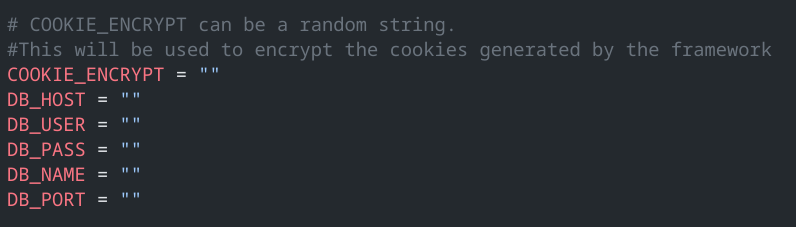

# healthcare web system (WIP)

- this project represents my journey about collecting and using my knowledge of React TypeScript and Golang to create a application that is as optimized and secure as i can make it.

#### requirements:

1. Package manager (npm, yarn, bun, pnpm)
2. golang (minimal 1.21.0)
3. postgress 16

#### development installation:

1. clone the package from github.
2. create a .env file in the _server folder_ with the following structure 
3. run the install command on your package manager in the _web folder_.
4. run the `go mod download` in the _server folder_.
5. the server can be started using `air` and the frontend can be started using the dev command using your package manager
